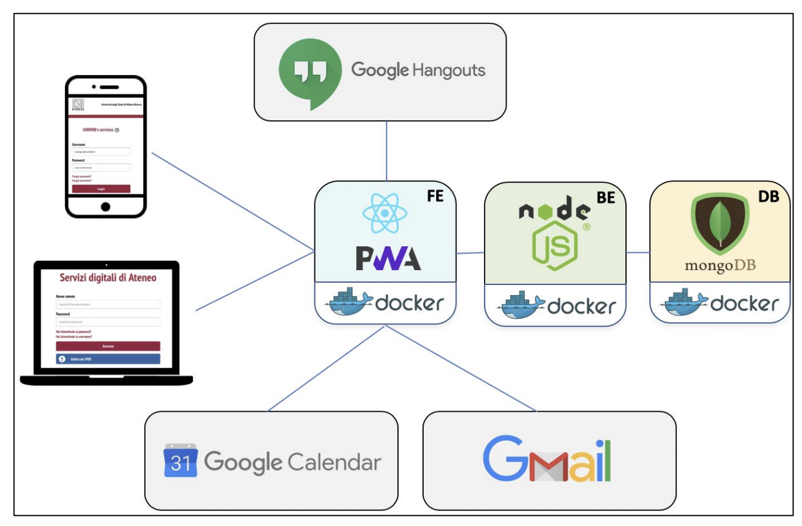

# UniMiB Calendar

## Descrizione

L'applicazione permette la gestione degli appuntamenti tra studenti e professori del DISCo. Essa si integra con servizi Google come Google Calendar, Hangouts e Gmail attraverso le relative API.

## Architettura di alto livello

